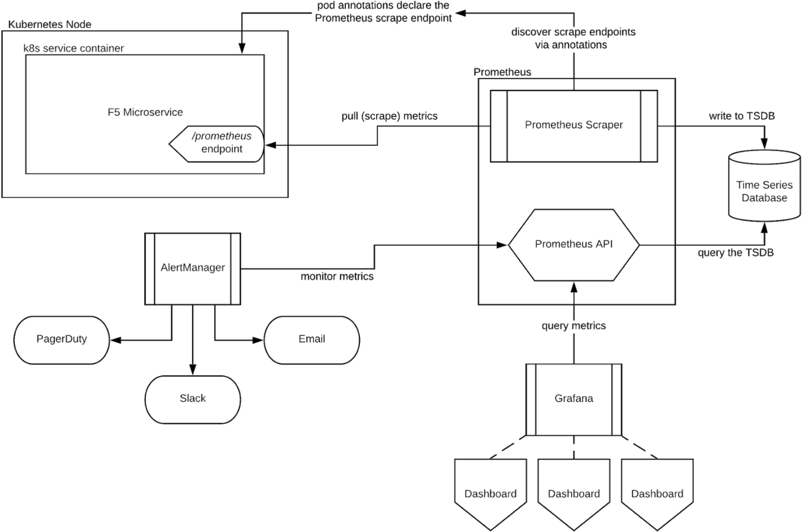
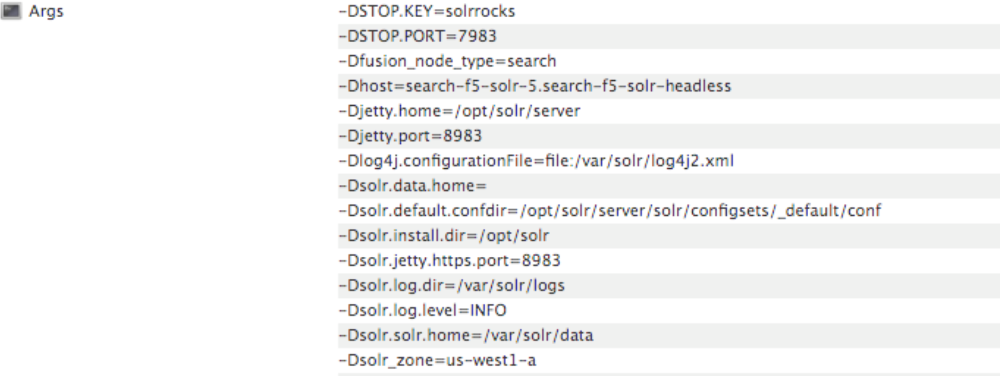

= Fusion 5 Survival Guide: Planning Your Fusion Install
:toc:
:toclevels: 3
:toc-title:

// tag::body[]

At this point, we assume you have a Kubernetes cluster running and have identified the namespace where you want to install Fusion. If you do not have a running cluster, you can use one of our setup scripts from the link:https://github.com/lucidworks/fusion-cloud-native[fusion-cloud-native repo^] to create one for you. However, we recommend you define the cluster using your own process as the clusters created by our scripts are intended for demo / getting started purposes.

NOTE: We will still use the `setup_f5_*.sh` scripts to perform the installation and upgrade tasks for Fusion, but will assume you've already created a cluster using the approved process for your organization.

=== Prerequisites

Please make sure you've installed the cloud provider specific command-line tools and have a working *kubectl* as described in the link:https://github.com/lucidworks/fusion-cloud-native[fusion-cloud-native repo^]. If you have not done so already, clone that repo. If you already cloned the repo, pull the master branch to get the latest changes.

==== Install Helm v3

Lucidworks recommends upgrading to Helm v3 for installing and upgrading Fusion on Kubernetes. Helm v3 no longer uses the server-side Tiller component.

On a Mac:
[source,bash]
----
brew upgrade kubernetes-helm
----

For other OS, download from link:https://github.com/helm/helm/releases[Helm Releases^].

Verify:

[source,bash]
----
helm version --short
v3.0.0+ge29ce2a
----

==== Kubernetes namespace

Fusion 5 service discovery requires all services for the same release be deployed in the same namespace. Moreover, you should only run one instance of Fusion in a namespace. If you need multiple instances of Fusion running in the same Kubernetes cluster, then you need to deploy them in separate namespaces. If your organization requires CPU / Memory quotas for namespaces, you can start with a minimum of 12 CPU and 45GB of RAM (such as 3 x n1-standard-4 on GKE), but you will need to increase the quotas once you start load testing Fusion with production workloads and real datasets. Fusion requires at least 3 Zookeeper and 2 Solr nodes to achieve high-availability.

Before proceeding with the installation, collect the following information about your K8s environment:
* *CLUSTER*: Cluster name (passed to our setup scripts using the `-c` arg)
* *NAMESPACE*: K8s namespace where your Fusion cluster is running
* *RELEASE*: The unique Helm release name to use for Fusion, such as `f5`

==== Docker registry

The Fusion Helm chart points to public Docker images on DockerHub. Your organization may not allow K8s to pull images directly from DockerHub or may require additional security scanning before loading images into production clusters. Work with your K8s / Docker admin team to determine how to get the Fusion images loaded into a registry that is accessible to your cluster. You can update the image for each service using the custom values YAML file discussed in the next section.

=== Custom values YAML

Throughout this topic, you will make changes to a custom values YAML file to refine your configuration of Fusion. You should keep this file in version control as you will need to make changes to it over time as you fine tune your Fusion installation; it will also be needed to perform upgrades.

The link:https://github.com/lucidworks/fusion-cloud-native[fusion-cloud-native repo^] contains a template for creating the custom values YAML file:

```
customize_fusion_values.yaml.example
```

Our setup scripts (`setup_f5_*.sh`) use the `customize_fusion_values.yaml.example` file as a template to create a custom values YAML for your cluster if it does not already exist. Consequently, you'll see some replaceable parameters in the file, such as `{NODE_POOL}`. However, since we're going to make a number of customizations in this file throughout this topic, so let's create a working copy using the `customize_fusion_values.sh` utility script provided in the repo. You should name your custom values YAML file using the following convention:

```
<provider>_<cluster>_<release>_fusion_values.yaml
```

where `<provider>` is the K8s platform you’re running on, such as GKE, `<cluster>` is the name of your cluster, and `<release>` is the name you give to your Fusion release, such as `f5`. For instance, if you're running on GKE, your cluster is named `search`, and you're using the `f5` release label, you would pass `gke_search_f5_fusion_values.yaml` to the script as shown below:

```
./customize_fusion_values.sh gke_search_f5_fusion_values.yaml \
  -c <CLUSTER> \
  -r <RELEASE> \
  --num-solr 3 \
  --solr-disk-gb 100 \
  --prometheus true
```

TIP: Pass the `--help` parameter to see script usage details

After creating the custom values YAML file, take a moment to go through it to familiarize yourself with its structure and contents. You'll notice a separate section for each of the Fusion services listed in Table 1. Let's take a look at the configuration for the query-pipeline service to illustrate some important concepts about the custom values YAML (extra spacing added for display purposes only):

[source,yaml]
----
  query-pipeline:           # Service-specific setting overrides under the top-level heading

    enabled: true           # Every Fusion service has an implicit enabled flag that defaults
                            # to true, set to false to remove this service from your cluster

    nodeSelector:           # Node selector identifies the label find nodes to schedule pods on
      cloud.google.com/gke-nodepool: default-pool

    javaToolOptions: "..."  # Used to pass JVM options to the service

    pod:                    # Pod annotations to allow Prometheus to scrape metrics from the service
      annotations:
        prometheus.io/port: "8787"
        prometheus.io/scrape: "true"
----

The `--prometheus true` option shown in the example above activates the Solr metrics exporter service and add pod annotations so that Prometheus can scrape metrics from Fusion services. Using this option also causes the script to create additional custom value YAML files for Prometheus and Grafana, such as `gke_search_f5_prom_values.yaml` and `gke_search_f5_graf_values.yaml`. You should also keep these files in source control. Of course if you don't want to use Prometheus, simply pass `--prometheus false` to the script.

Once we go through all of the configuration topics in this section, you'll have a well-configured custom values YAML file for your Fusion 5 installation. You'll then use this file during the Helm v3 installation at the end of this section.

Next let's see how to monitor the health and performance of Fusion services using Prometheus and Grafana.

=== Monitoring and alerting with Prometheus and Grafana

Lucidworks recommends using Prometheus and Grafana for monitoring the performance and health of your Fusion cluster. The following diagram depicts how metrics work in a Fusion cluster:

ifdef::env-github[]

endif::[]
ifndef::env-github[]

endif::[]

Notice in the diagram that Prometheus pulls (or "scrapes") metrics from Fusion services. Prometheus identifies which services to pull metrics from using pod annotations. For instance, to enable metrics for the Fusion `query-pipeline` service, you add the following pod annotations for the query service in the custom values YAML file (this is already done for you in the `customize_fusion_values.yaml.example` template).

[source,yaml]
----
query-pipeline:
  ...
  pod:
    annotations:
      prometheus.io/port: "8787"
      prometheus.io/scrape: "true"
----

If you used the `--prometheus true` option when running the `customize_fusion_values.sh` script in the previous section, then you will have custom value YAML files for Prometheus and Grafana. You can use these files when installing Prometheus and Grafana; the settings should work for most Fusion clusters but you should review the contents of each to ensure the settings are suited for your needs, such as how long to keep metrics (default is 48h). For more information on how to configure these services, see link:https://github.com/helm/charts/tree/master/stable/prometheus[Prometheus^] and link:https://github.com/helm/charts/tree/master/stable/grafana[Grafana^] helm chart information.

We'll cover how to install the default Grafana dashboards provided in the link:https://github.com/lucidworks/fusion-cloud-native[fusion-cloud-native repo^] later in this topic.

After the initial installation of Prometheus and Grafana, you'll need to use helm directly for making changes to those services as the `setup_f5_*.sh` scripts do not perform upgrades on Prometheus and Grafana. For instance, if you change a setting in the prom values YAML, you would do:

[source,bash]
----
helm upgrade ${RELEASE}-prom stable/prometheus --namespace "${NAMESPACE}" \
  -f "$PROMETHEUS_VALUES" --version 9.0.0
----

=== Solr sizing

When you're ready to build a production ready setup for Fusion 5, you need to customize the Fusion Helm chart to ensure Fusion is well-configured for production workloads.

You'll be able to scale the number of nodes for Solr up and down after building the cluster, but you need to establish the initial size of the nodes (memory and CPU) and size / type of disks you need.

Let's walk through an example config so you understand which parameters to change in the custom values YAML file.

[source,yaml]
----
solr:
  resources:                    # Set resource limits for Solr to help K8s pod scheduling;
    limits:                     # these limits are not just for the Solr process in the pod,
      cpu: "7700m"              # so allow ample memory for loading index files into the OS cache (mmap)
      memory: "26Gi"
    requests:
      cpu: "7000m"
      memory: "25Gi"
  logLevel: WARN
  nodeSelector:
    fusion_node_type: search    # Run this Solr StatefulSet in the "search" node pool
  exporter:
    enabled: true               # Enable the Solr metrics exporter (for Prometheus) and
                                # schedule on the default node pool (system partition)
    podAnnotations:
      prometheus.io/scrape: "true"
      prometheus.io/port: "9983"
      prometheus.io/path: "/metrics"
    nodeSelector:
      cloud.google.com/gke-nodepool: default-pool
  image:
    tag: 8.3.1
  updateStrategy:
    type: "RollingUpdate"
  javaMem: "-Xms11g -Xmx11g -Xmn4g -XX:ParallelGCThreads=8" # Configure memory settings for Solr
  volumeClaimTemplates:
    storageSize: "100Gi"        # Size of the Solr disk
  replicaCount: 6               # Number of Solr pods to run in this StatefulSet

zookeeper:
  nodeSelector:
    cloud.google.com/gke-nodepool: default-pool
  replicaCount: 3               # Number of Zookeepers
  persistence:
    size: 20Gi
  resources: {}
  env:
    ZK_HEAP_SIZE: 1G
    ZOO_AUTOPURGE_PURGEINTERVAL: 1
----

To be clear, you can tune GC settings and number of replicas after the cluster is built. But changing the size of the persistent volumes is more complicated so you should try to pick a good size initially.

==== Configure storage class for Solr pods (optional)

If you wish to run with a storage class other than the default you can create a storage class for your Solr pods before you install. For example to create regional disks in GCP you can create a file called `storageClass.yaml` with the following contents:

[source,yaml]
----
kind: StorageClass
apiVersion: storage.k8s.io/v1
metadata:
 name: solr-gke-storage-regional
provisioner: kubernetes.io/gce-pd
parameters:
 type: pd-standard
 replication-type: regional-pd
 zones: us-west1-b, us-west1-c
----

and then provision into your cluster by calling:

[source,bash]
----
kubectl apply -f storageClass.yaml
----

to then have Solr use the storage class by adding the following to the custom values YAML:

[source,yaml]
----
solr:
  volumeClaimTemplates:
    storageClassName: solr-gke-storage-regional
    storageSize: 250Gi
----

NOTE: We're not advocating that you must use regional disks for Solr storage, as that would be redundant with Solr replication. We're just using this as an example of how to configure a custom storage class for Solr disks if you see the need. For instance, you could use regional disks without Solr replication for write-heavy type collections.

=== Multiple node pools

As discussed in the Workload Isolation with Multiple Node Pools section above, Lucidworks recommends isolating search workloads from analytics workloads using multiple node pools. You'll need to define multiple node pools for your cluster as our scripts do not do this for you; we do provide an example script for GKE, see `create_gke_cluster_node_pools.sh`.

In the custom values YAML file, you can add additional Solr StatefulSets by adding their names to the list under the nodePools property. If any property for that statefulset needs to be changed from the default set of values, then it can be set directly on the object representing the node pool, any properties that are omitted are defaulted to the base value. See the following example (additional whitespace added for display purposes only):

[source,yaml]
----
solr:
  nodePools:
    - name: ""                      # Empty string "" is the suffix for the default partition

    - name: "analytics"             # Override settings for analytics Solr pods
      javaMem: "-Xmx6g"
      replicaCount: 6
      storageSize: "100Gi"
      nodeSelector:                 # Assign analytics Solr pods to the node pool
        fusion_node_type: analytics # with label fusion_node_type=analytics
      resources:
        requests:
          cpu: 2
          memory: 12Gi
        limits:
          cpu: 3
          memory: 12Gi
    - name: "search"                # Override settings for search Solr pods
      javaMem: "-Xms11g -Xmx11g"
      replicaCount: 12
      storageSize: "50Gi"
      nodeSelector:                 # Assign search Solr pods to the node pool
        fusion_node_type: search    # with label fusion_node_type=search
      resources:
        limits:
          cpu: "7700m"
          memory: "26Gi"
        requests:
          cpu: "7000m"
          memory: "25Gi"
  nodeSelector:                                 # Default settings for all Solr pods if not
    cloud.google.com/gke-nodepool: default-pool # specifically overridden in the nodePools section above
...
----

In the above example the analytics partition will have 6 replicas (Solr pods), but the search nodepool would have 12 replicas. Each nodepool would automatically be assigned the property of `-Dfusion_node_type=<search/system/analytics>` which matches the name of the nodePool. The empty nodePool name `""` just maps to the default settings / node pool if not specifically overridden.

The Solr pods will have a `fusion_node_type` system property set on them as shown below:



You can use the `fusion_node_type` property in Solr auto-scaling policies to govern replica placement during collection creation.

[[solr-autoscaling]]
=== Solr auto-scaling policy

You can configure a custom Solr auto-scaling policy in the custom values YAML file under the `fusion-admin` section as shown below:
[source,yaml]
----
fusion-admin:
  ...
  solrAutocalingPolicyJson:
    {
      "set-cluster-policy": [
        {"node": "#ANY", "shard": "#EACH", "replica":"<2"},
        {"replica": "#EQUAL", "sysprop.solr_zone": "#EACH", "strict" : false}
      ]
    }
----
You can use an auto-scaling policy to govern how the shards and replicas for Fusion system and application-specific collections are laid out.

If your cluster defines the search, analytics, and system node pools, then we recommend using the policy.json provided in the link:https://github.com/lucidworks/fusion-cloud-native[fusion-cloud-native repo^] as a starting point. The Fusion Admin service will apply the policy from the custom values YAML file to Solr before creating system collections during initialization.

=== Pod network policy

A Kubernetes network policy governs how groups of pods are allowed to communicate with each other and other network endpoints. With Fusion, it's expected that all incoming traffic flows through the API Gateway service. Moreover, all Fusion services in the same namespace expect an internal JWT to be included in the request, which is supplied by the Gateway. Consequently, Fusion services enforce a basic level of API security and do not need an additional network policy to protect them from other pods in the cluster. However, some organizations will still want to configure a network policy. Lucidworks will provide a starting policy YAML file with Fusion 5.1.

=== Install Fusion 5 on Kubernetes

At this point, you're ready to install Fusion 5 using your custom values YAML file. Use the appropriate setup script for your platform, such as `setup_f5_aks.sh` for AKS. If you're not running on AKS, EKS, or GKE, then simply use the `setup_f5_k8s.sh` script. Pass the `--help` option to see script usage details. For instance, the following command will install Fusion along with Prometheus and Grafana into the default namespace in a cluster named search running in the us-west1 region with the f5 release label:

[source,bash]
----
./setup_f5_gke.sh -c search -p gcp-project -z us-west1 \
  -r f5 -n default --prometheus install \
  -t -h <ingress-hostname>
----

Once the install completes, refer to the Verifying the Fusion Installation steps to verify your Fusion installation is running correctly.

IMPORTANT: If you used our script to configure an Ingress for the API gateway service, (`-t -h` options), then you should move the contents of the `tls-values.yaml` file under the `api-gateway` section of your main custom values YAML file. This alleviates having to keep track of both configuration files when upgrading. For instance, if you passed `-t -h test1.lucidworkssales.com` to the setup script, then you would copy the contents of `tls-values.yaml` to your main custom values YAML file under the `api-gateway` section as shown below:

[source,yaml]
----
api-gateway:
  service:
    type: "NodePort"
  ingress:
    enabled: true
    host: "test1.lucidworkssales.com"
    tls:
      enabled: true
    annotations:
      "networking.gke.io/managed-certificates": "f502rc6-managed-certificate"
      "kubernetes.io/ingress.class": "gce"
  nodeSelector:
    cloud.google.com/gke-nodepool: default-pool
  pod:
    annotations:
      prometheus.io/port: "6764"
      prometheus.io/scrape: "true"
----

// end::body[]
